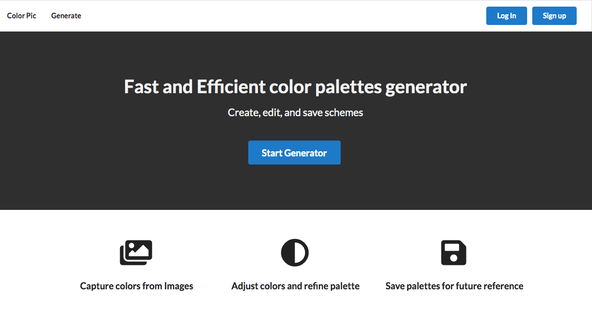
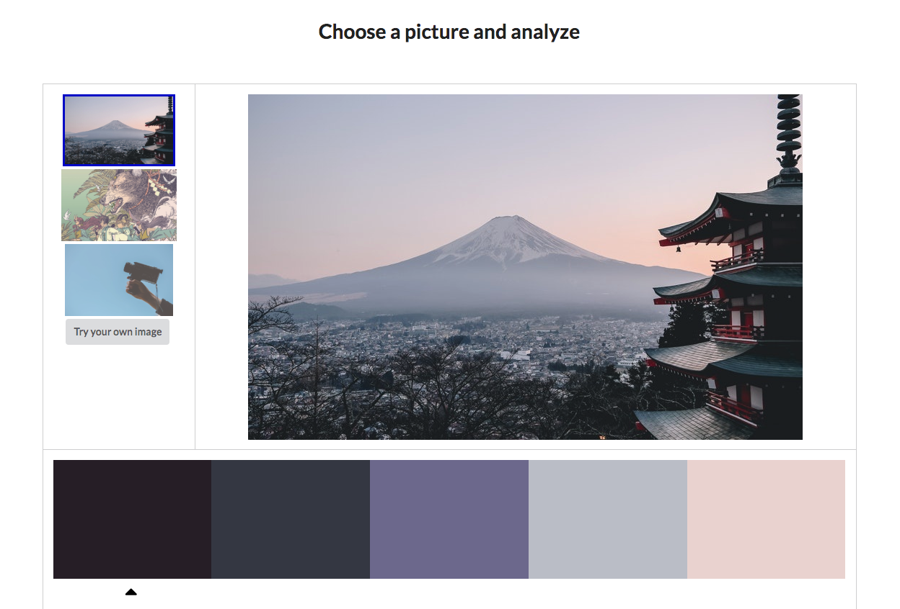

# Color Pic

The Color Pic application uses image recognition to predict what the dominant colors are in a given picture. The colors are then used to generate a suggested color palette with colors that work well together. This works in a semi-random way, so hit regenerate to see a different color set each time.

### User Story:

- User can upload a picture url, capture the main colors, and generate a selected color palette
- User can adjust colors
- User can save palettes for future reference
- User can create a new user profile and login

### [Live Demo](https://color-pic.herokuapp.com/)

## Technology

React, Redux, Semantic UI React, Axios, [React Color](https://casesandberg.github.io/react-color/), Node.js, Express, MongoDB

## API Info

- [Clarifai](https://www.clarifai.com/models/color-image-recognition-model-eeed0b6733a644cea07cf4c60f87ebb7)
- [Colormind.io](http://colormind.io/api-access/)

## Running locally

- Install dependencies for server ==> npm install
- Install dependencies for client ==> npm run client-install
- Run the client & server with concurrently ==> npm run dev
- Run the Express server only ==> npm run server
- Run the React client only ==> npm run client
- Server runs on http://localhost:5000 and client on http://localhost:3000

### Requirements

Add mongoURI and jwtSecret to keys.js in config folder 
Clarifai developer key required in client/src folder [Developer Guide](https://www.clarifai.com/developer/guide/)
